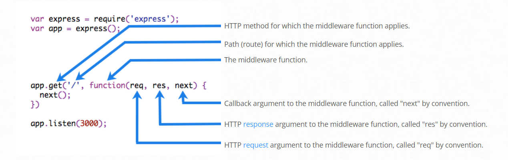

# Middleware in Node.js

A middleware is a simple function that has the **ability to handle incoming requests and outbound response objects**.

It's a function that receives the request and response objects. The most common tasks that the middleware functions perform are:

* Execute any code.
* Update or modify the request and the response objects.
* Finish the request-response cycle.
* Invoke the next middleware in the stack.

_Middleware_ functions are functions that have access to the [request object](https://expressjs.com/en/4x/api.html#req) (`req`), the [response object](https://expressjs.com/en/4x/api.html#res) (`res`), and the `next` function in the application’s request-response cycle. The `next` the function is a function in the Express router that, when invoked, executes the middleware, succeeding the current middleware.

<figure><figcaption><p>middleware</p></figcaption></figure>

Here is an example **Middleware function** for myLogger

```javascript
const express = require('express')
const app = express()

const myLogger = function (req, res, next) {
  console.log('LOGGED')
  next()
}

app.use(myLogger)

app.get('/', (req, res) => {
  res.send('Hello World!')
})

app.listen(3000)
```


Another example of auth-check middleware...

```javascript
const jwt = require('jsonwebtoken')
const { JWT_KEY_USER } = require('../../config/constants')
const { status } = require('../../config/statuscode')

module.exports = async function (req, res, next) {

    let token = (req.body && req.body.token) || (req.query && req.query.token) || req.headers['token'];

    if (token) {
        try {
            let decoded = jwt.verify(token, JWT_KEY_USER);
            req.userData = decoded
            next();
        } catch (err) {
            console.error("🚀 ~ file: user-auth-check.js ~ line 15 ~ err", err)
            return res.status(status.unauthorized_code).json({
                message: "Oops! Auth failed."
            })
        }
    } else {
        return res.status(status.unauthorized_code).json({
            message: "Please enter token."
        })
    }
};
```

Now here is the way how we can use that auth-check middleware...

```javascript
const express = require('express');
const router = express.Router();

/* ---------- middleware ---------- */
const userAuthCheck = require("../../middleware/app/user-auth-check");

/* ---------- controllers ---------- */
const userController = require('../../controllers/app/userController')

router.put('/update-profile', userAuthCheck, userController.updateProfile);

module.exports = router;
```
